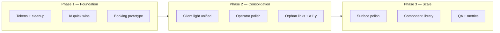

# UI Design Evolution — Phased Implementation Plan

Based on [council-verdict-ui.md](./council-verdict-ui.md) and [council-prompt-ui.md](./council-prompt-ui.md).

**Principles (non-negotiable):**
- Keep **three visual systems**: Operator Dark, Client Light, Sheet sub-language
- Do **not** force operator dark onto booking/portal
- Every phase ships something testable; no multi-week refactors without a visible delta

**Solo-dev estimate:** ~12 weeks at ~15–20 hrs/week (council’s 90-day model)

---

## Overview



| Phase | Weeks | Theme | Exit criteria |
|-------|-------|-------|---------------|
| **1** | 1–4 | Fix foundations + booking prototype | One green system; booking step 2 redesigned; messages discoverable |
| **2** | 5–8 | Unify client light + operator consistency | Portal + book share `client-light.css`; QuickAddJob on operator tokens |
| **3** | 9–12 | Polish + extract components | Shared Button/Input/Card; reports/inventory/settings tightened |

---

## Phase 0 — Prep (optional, ~2 hours)

Do once before Week 1 if you want clean baselines.

| Task | Action |
|------|--------|
| Screenshot baseline | Capture 11 surfaces listed in `council-prompt-ui.md` |
| Branch strategy | `design/phase-1` or one branch per phase |
| Test slugs | Confirm `/book/test`, `/portal/{token}`, `/jobs/new` work locally |
| Metrics | Note current booking completion rate if you have analytics; else manual test script |

---

## Phase 1 — Foundation & Critical UX (Weeks 1–4)

**Goal:** Stop token bleed, fix the worst UX bug, prove the unified client-light direction on booking.

### Week 1 — Token standardization & CSS cleanup (~16 hrs)

#### 1.1 Green accent unification (8h)

**Target:** Single primary green `#22c55e` (`globals.css --green`).

| File | Current | Change |
|------|---------|--------|
| `src/app/book/book.css` | `--book-green: #16a34a` | → `#22c55e` (+ adjust green-bg/bdr tints) |
| `src/app/app-ui.css` | `--green: #4caf50` | → reference `var(--green)` from globals or `#22c55e` |
| `src/components/QuickAddJob.css` | `#3dc97a` price, `#3dc97a` borders | → `var(--green)` / `var(--green-text)` |
| `src/app/portal/portal.css` | already `#22c55e` | verify only |

**Deliverable:** Grep shows no hardcoded `#16a34a`, `#4caf50`, `#3dc97a` in UI CSS (inventory `--inv-ok` may stay as separate semantic).

**Acceptance:** Primary CTAs, nav active state, booking buttons, portal accent all visually match.

#### 1.2 Dead CSS removal & audit start (8h)

| Action | Files |
|--------|-------|
| **Delete or stop importing** | `src/app/home/home.css` if unused (confirm `HomeScreen` not routed) |
| **Remove or mount** | `JobsRevenueChart.tsx` + `.jobs-chart-*` — either wire on `/jobs` or delete |
| **Document conflicts** | Spreadsheet or markdown: globals `.clients-*` vs app-ui `.client-card`, duplicate `.bottom-nav` rules |

**Deliverable:** `docs/ui-css-audit.md` listing owner file per pattern (card, list row, page header).

**Do not:** Merge globals + app-ui in Week 1 — audit only.

---

### Week 2 — IA quick wins + QuickAddJob tokens (~28 hrs)

#### 2.1 Messages discoverability (4h)

| Task | Files |
|------|-------|
| Add header icon on Dashboard | `src/components/Dashboard.tsx` |
| Style (may exist in `messages.css`) | `.home-header__messages` or new icon-btn |
| Link | `/messages` |

**Acceptance:** From `/`, one tap to messages without knowing URL.

#### 2.2 FAB menu expansion (4h)

| Task | Files |
|------|-------|
| Add rows | `src/components/QuickActionMenu.tsx` |
| New Quote | → `/quotes/new` |
| View Messages | → `/messages` |

**Acceptance:** FAB shows 6 actions; existing 4 unchanged.

#### 2.3 QuickAddJob → operator tokens (12h)

Replace isolated hex with globals semantic tokens:

| QuickAddJob | → Operator |
|-------------|------------|
| `#1e1e1e` surfaces | `var(--bg-surface)` |
| `#2a2a2a` borders | `var(--border)` |
| `#1a3a2a` selected | `var(--green-dim)` |
| `#3dc97a` / `#555` labels | `var(--green-text)` / `var(--text-muted)` |

**Files:** `QuickAddJob.css` (primary), spot-check `QuickAddJob.tsx` for inline colors.

**Do not:** Redesign layout yet — token swap only.

#### 2.4 Operator surface token pass — app-ui (8h)

- Point `app-ui.css` `--bg-card`, `--bg-card-2` at globals surfaces where safe
- Fix bottom nav green to use `var(--green)`

---

### Weeks 3–4 — Booking prototype (3–5 days / ~24–40 hrs)

**Council’s #1 prototype.** Ship on `/book/[slug]` only; portal untouched until Phase 2.

#### 3.1 Create `client-light.css` (foundation only for book)

**New file:** `src/app/client-light.css`

```css
/* Shared client tokens — consumed by book now, portal in Phase 2 */
.client-light-root {
  --cl-bg: #fafafa;
  --cl-surface: #ffffff;
  --cl-raised: #f7f7f5;
  --cl-border: #e5e5e5;
  --cl-text: #111111;
  --cl-muted: #737373;
  --cl-hint: #a3a3a3;
  --cl-accent: #22c55e;
  --cl-accent-hover: #16a34a;
  --cl-radius-card: 16px;
  --cl-radius-control: 12px;
  --cl-max-width: 430px;
}
```

- Import in `globals.css`
- Apply `.client-light-root` on `.book-root` (alias existing `--book-*` to `--cl-*` or migrate class names)

#### 3.2 Redesign Step 2 — date & time

**Remove:** Static clock box (`book-datetime-box--static` beside date).

**Replace with:**

```
DATE
┌─────────────────────────────────────┐
│ 📅  Thursday, Jun 26, 2026        │  ← single full-width date control
└─────────────────────────────────────┘

PICK A TIME
┌─────────┐ ┌─────────┐ ┌─────────┐
│ 8:00 AM │ │10:00 AM │ │ 2:00 PM │  ← slots; selected state obvious
└─────────┘ └─────────┘ └─────────┘
```

**Implementation options (pick one in prototype):**

| Option | Pros | Cons |
|--------|------|------|
| **A. Native date + slot grid only** | iOS-safe, fast | Less “designed” |
| **B. Date scroll + slot grid** | Clear hierarchy | More CSS |
| **C. Bottom sheet date picker** | On-brand with sheets | Heavier; test mobile |

**Recommendation:** Option A for prototype — full-width labeled date field + section title “Pick a time” + sticky selected time line above grid.

**Files:** `src/app/book/[slug]/page.tsx`, `book.css`

#### 3.3 Booking flow polish (same sprint)

| Item | Change |
|------|--------|
| Sticky summary | Package name + price visible steps 2–3 (footer or top of card) |
| Location copy | Mobile → “We come to you”, Fixed → “Drop-off location” |
| Step 3 collapse | Vehicle + location + notes behind “More options” (defaults: sedan, mobile) |
| Confirmation | Stronger success state; formatted date/time |
| Shell width | `app-shell--book` max-width **430px** |
| Fonts | Syne h1/CTA, DM Sans body (already mostly true) |

#### 3.4 Phase 1 exit checklist

- [ ] Greens unified on booking + operator nav + FAB
- [ ] Dead CSS removed or documented
- [ ] Messages reachable from home header
- [ ] FAB has Quote + Messages
- [ ] QuickAddJob uses globals tokens (visual parity with rest of dark app)
- [ ] Booking step 2 has no fake clock box
- [ ] `client-light.css` exists and powers book page
- [ ] Manual test: iOS Safari date + slot selection on `/book/test`
- [ ] `npm run build` passes

**Phase 1 demo:** Record 2-min walkthrough: home → messages, FAB → quote, full booking flow.

---

## Phase 2 — Consolidation & Polish (Weeks 5–8)

**Goal:** Portal joins client-light system; operator app feels like one product; orphans linked in context.

### Week 5 — Portal unification + BackButton (28h)

#### 5.1 Migrate portal to `client-light.css` (24h)

| Task | Detail |
|------|--------|
| Map `--portal-*` → `--cl-*` | Keep `.portal-root` as scope class |
| Fonts | Syne headings, DM Sans body (match book) |
| Accent | `#22c55e` only |
| Deprecate duplicate tokens | Thin `portal.css` to layout-only overrides |
| Photo mode | `.portal-root--photos` stays dark — document as intentional sub-scope |

**Files:** `portal/portal.css`, `portal/*` components, `globals.css` import order

#### 5.2 BackButton standardization (4h)

- Audit all detail pages for `BackButton` vs inline `CaretLeft`
- Standardize: `BackButton` component everywhere in operator app
- **Files:** `JobDetail`, `ClientDetail`, `Settings`, `messages`, inventory subpages, etc.

---

### Week 6 — QuickAddJob footer + Dashboard (12h)

#### 6.1 QuickAddJob footer (4h)

Replace `.new-job-save-btn` / `.new-job-footer` with:
- `.btn-primary` (save)
- `.btn-ghost` (expenses secondary)

**Keep:** Fixed footer layout; only button classes change.

#### 6.2 Dashboard polish (8h)

| Item | Detail |
|------|--------|
| KPI | Add client count to `stat-grid` if data available |
| Typography | Align `.page-header` with settings (22–26px hierarchy) |
| Inventory alert | Ensure `InventoryAlertCard` uses unified greens |

**Files:** `Dashboard.tsx`, `app-ui.css`

---

### Week 7 — Jobs list + contextual orphan links (20h)

#### 7.1 Jobs list (12h)

- Chip active states: clearer green fill vs outline
- `.job-card` padding/spacing consistency
- Status badges aligned with globals `.badge-*`

#### 7.2 Quotes & invoices links (8h)

| From | Link |
|------|------|
| `JobDetail` | “Create quote”, “View invoice” if exists |
| `ClientDetail` | Quotes history section or link to filtered quotes |
| `Reports` | Secondary row: “All invoices” → `/invoices`, “All quotes” → `/quotes` |

**Do not:** Add bottom nav tabs.

---

### Week 8 — Sheets + accessibility (20h)

#### 8.1 Sheet save button alignment (4h)

- Document: inverted `.inv-sheet-save` is intentional
- Align label copy (“Save”, “Add expense”) with `.btn-primary` semantics
- Optional: green variant for primary sheet action on dark sheet

#### 8.2 Accessibility pass — critical paths (16h)

| Flow | Checks |
|------|--------|
| Booking | focus order, 44px targets, error announcements |
| QuickAddJob | date/time inputs usable VoiceOver |
| Bottom nav + FAB | aria labels, focus trap in sheets |
| Portal | contrast on light cards |

**Deliverable:** `docs/a11y-audit-phase2.md` with fixed issues list.

#### Phase 2 exit checklist

- [ ] Portal and book share `client-light.css` tokens
- [ ] Both client routes 430px max width
- [ ] BackButton consistent
- [ ] QuickAddJob footer uses global buttons
- [ ] Quotes/invoices reachable from jobs/clients/reports
- [ ] a11y issues on booking + job create documented/fixed

---

## Phase 3 — Optimization & Component Library (Weeks 9–12)

**Goal:** Extract reusable primitives; polish remaining surfaces; prepare for per-org branding.

### Week 9 — Inventory + Settings (28h)

#### 9.1 Inventory (16h)

- Category home vs grid hierarchy review
- Align `--inv-*` greens with global `--green` where semantic
- Product tile density on 390px

#### 9.2 Settings (12h)

- `.settings-booking-card` extends `.card` base
- Section spacing rhythm (`.settings-section-head` + desc)
- Toggle row alignment with globals

---

### Week 10 — Reports + empty states (24h)

#### 10.1 Reports (16h)

- `.money-hero` readability (profit/loss color + size)
- Chart legibility at 390px
- Export buttons → `.btn-ghost` consistency

#### 10.2 Empty states (8h)

- Standardize `.empty-state` + `.empty-cta` on jobs, clients, quotes, inventory
- One illustration/icon pattern (Phosphor, muted)

---

### Week 11–12 — Component library + QA (32–40h)

#### 11.1 Extract shared components (ongoing)

**Priority order:**

1. `Button` — primary, ghost, danger, secondary (map existing classes)
2. `Input` — text, tel, email with icon slot
3. `Card` — default, pressable
4. `Badge` — status variants
5. `ToggleGroup` — location-style segmented control
6. `FieldLabel` — 10px uppercase pattern

**Location:** `src/components/ui/` — thin wrappers, **CSS modules or existing class names** (no Tailwind rewrite).

**Theme strategy:** Components accept `variant="operator" | "client"` or use CSS variables from parent scope.

#### 11.2 globals vs app-ui consolidation

- Pick **one owner** for list cards (`.job-card`, `.client-card`)
- Migrate duplicates from globals to app-ui or vice versa
- Remove dead `.clients-*` if unused

#### 11.3 Cross-browser QA matrix

| Surface | Chrome | Safari iOS | Safari macOS |
|---------|--------|------------|--------------|
| Book step 2 | ✓ | ✓ | ✓ |
| QuickAddJob | ✓ | ✓ | — |
| Portal photos | ✓ | ✓ | — |
| PIN auth | — | ✓ | — |

#### 11.4 Future-ready: per-org branding (design only)

Document token hooks for Phase 4 (not implemented in Phase 3):

```css
.client-light-root {
  --cl-accent: var(--org-accent, #22c55e);
}
```

Settings already has business name — logo upload = future PB field + portal/book header.

#### Phase 3 exit checklist

- [ ] `src/components/ui/` has Button, Input, Card, Badge
- [ ] Book + portal use extracted FieldLabel/Toggle where applicable
- [ ] CSS audit items resolved or explicitly deferred
- [ ] QA matrix signed off
- [ ] `council-phases-ui.md` updated with “completed” dates

---

## Phase 4 — Future (post-12 weeks, not scheduled)

| Initiative | Depends on |
|------------|------------|
| Per-org logo + accent on book/portal | PB schema, settings UI |
| 1-step booking experiment | Phase 1 prototype metrics |
| Mount `JobsRevenueChart` on jobs or money | Product decision |
| Light mode operator app | **Not recommended** per council |
| `HomeScreen` replacement for `Dashboard` | Only if KPI design justifies rewrite |

---

## Risk register

| Risk | Mitigation |
|------|------------|
| Booking date picker still broken on iOS | Phase 1 acceptance includes real device test; fallback to native-only UI |
| Portal regression when merging CSS | Phase 2: migrate portal page-by-page; keep photo dark scope isolated |
| Scope creep into full redesign | Each week has explicit “Do not” list |
| Component library delays surface work | Extract only when touching a file anyway (rule of three) |
| Breaking multi-tenant isolation | UI phases touch no PB rules / API auth |

---

## Dependency graph (what blocks what)

```
Week 1 greens ──────────────────────────────────┐
                                                 ▼
Week 3 client-light.css ◄── Week 1 greens ──► Booking prototype
                                                 │
Week 5 portal migration ◄────────────────────────┘
                                                 │
Week 11 component library ◄── Week 5–8 patterns stabilized
```

**Critical path:** Green tokens (W1) → `client-light.css` + booking redesign (W3–4) → portal migration (W5).

---

## Suggested commit / PR breakdown

| PR | Scope |
|----|-------|
| `design/green-tokens` | Week 1 |
| `design/css-cleanup` | Week 1 audit + deletes |
| `design/ia-messages-fab` | Week 2 |
| `design/quickaddjob-tokens` | Week 2 |
| `design/booking-prototype` | Weeks 3–4 (largest) |
| `design/portal-client-light` | Week 5 |
| `design/operator-polish` | Weeks 6–7 |
| `design/a11y-phase2` | Week 8 |
| `design/surface-polish` | Weeks 9–10 |
| `design/ui-primitives` | Weeks 11–12 |

---

## How to use this doc

1. Start **Phase 1 Week 1** — greens + audit (low risk, visible win)
2. Parallelize **Week 2** IA work while thinking about booking step 2 UX
3. Treat **Weeks 3–4** as a focused sprint with device testing built in
4. Re-run council or user test after Phase 1 prototype before committing to Phase 2 portal merge

**Related files:**
- [council-verdict-ui.md](./council-verdict-ui.md) — chairman decisions
- [council-prompt-ui.md](./council-prompt-ui.md) — full UI inventory for reference
